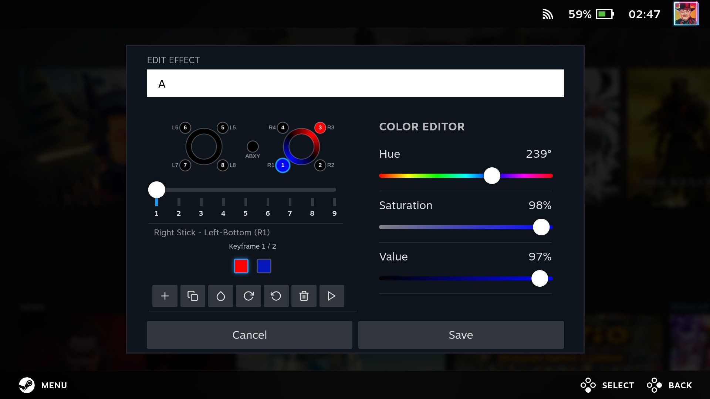

English | [简体中文](./README_cn.md)
# HueSync
[](https://gitHub.com/honjow/HueSync/releases) [](https://github.com/honjow/HueSync/releases/latest) [](https://github.com/honjow/HueSync/releases/latest)

Plugin for [decky-loader](https://github.com/SteamDeckHomebrew/decky-loader)

LED controller for handheld devices

|                           |
| ------------------------- |
|  |

## Supported Devices
### Directly Supported
- AYANEO
  - AIR/Pro/1S
  - 2/2S
  - GEEK/1S
- GPD
  - Win 4 (Support by [pyWinControls](https://github.com/pelrun/pyWinControls))
- OneXPlayer
  - OneXFly
  - X1
- Aokzoe
  - A1
  - A2
- ROG
  - Ally/X
  - Xbox Ally/X
- MSI
  - Claw
  - Claw 8
  - Claw 7
- Lenovo
  - Legion Go S
  - Legion Go/2

### Additional Support
Support for more Ayaneo devices through [ayaneo-platform](https://github.com/ShadowBlip/ayaneo-platform), can be obtained by installing the dkms module through [AUR](https://aur.archlinux.org/packages/ayaneo-platform-dkms-git). The latest ChimeraOS comes with it.

- AYANEO
  - AIR/Pro/1S
  - 2/2S
  - GEEK/1S
  - AIR Plus
  - SLIDE

Similarly, Support for Ayn devices through [ayn-platform](https://github.com/ShadowBlip/ayn-platform),  [AUR](https://aur.archlinux.org/packages/ayn-platform-dkms-git)
- AYN
  - Loki Max

## Custom RGB Effects

Some devices support advanced custom RGB effects with multi-frame animations and individual zone color control.

### Supported Devices

- **MSI Claw Series** - Hardware-accelerated for smoother animations
- **ASUS ROG Ally / Ally X** - Software animation engine
- **AYANEO Devices** - Software animation engine

These devices have commands to set individual LED zone colors, which makes custom effects possible. MSI devices use hardware animation interface, while ROG Ally and AYANEO use software algorithms to smoothly interpolate between keyframes.

### Editor Interfaces

**MSI Claw**  


**ASUS ROG Ally**  


**AYANEO**  


## One-step Installation
```
curl -L https://raw.githubusercontent.com/honjow/huesync/main/install.sh | sh
```