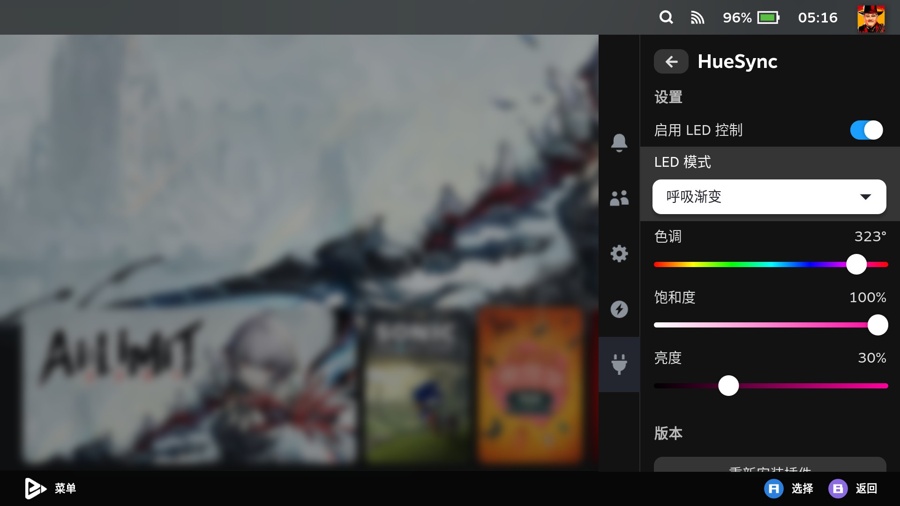
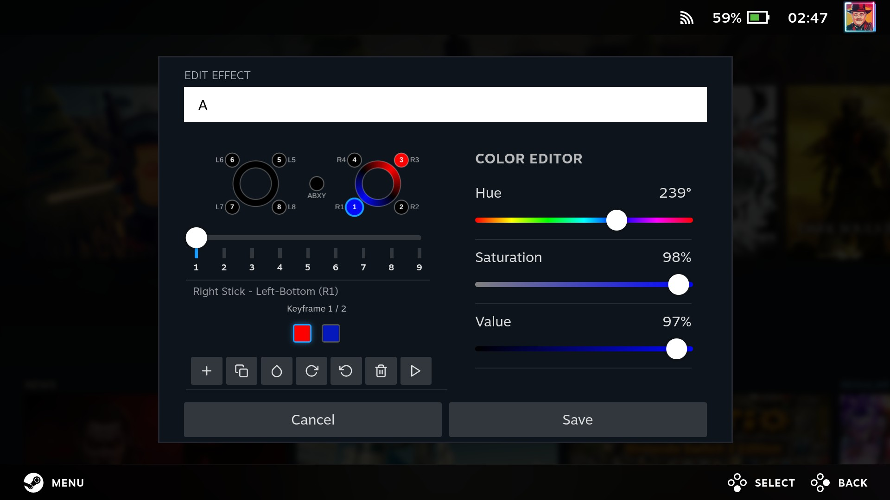
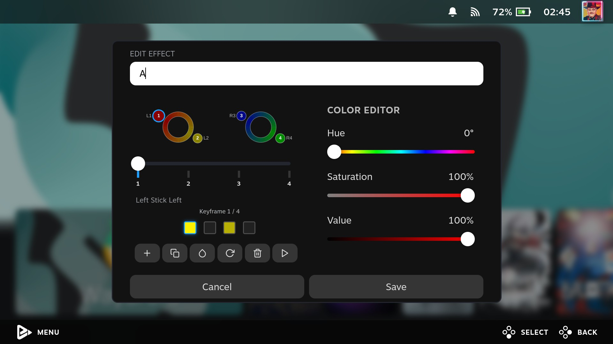
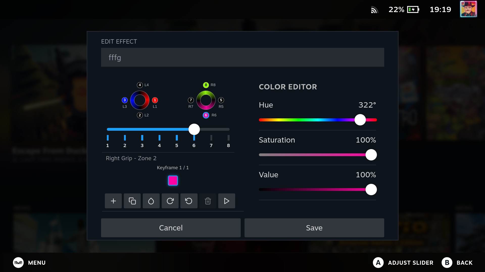

[English](./README.md) | 简体中文

# HueSync

[](https://gitHub.com/honjow/HueSync/releases) [](https://github.com/honjow/HueSync/releases/latest) [](https://github.com/honjow/HueSync/releases/latest)

用于[decky-loader](https://github.com/SteamDeckHomebrew/decky-loader)的插件

为手持设备提供 LED 灯光控制

|                           |
| ------------------------- |
|  |

## 支持设备

### 直接支持

- AYANEO
  - AIR/Pro/1S
  - 2/2S
  - GEEK/1S
- GPD
  - Win 4 (由 [pyWinControls](https://github.com/pelrun/pyWinControls) 提供支持)
- OneXPlayer
  - 飞行家
  - X1
- Aokzoe
  - A1
  - A2
- ROG
  - Ally
  - Ally X
- MSI
  - Claw
  - Claw 8
  - Claw 7
- Lenovo
  - Legion Go S
  - Legion Go (实验)

### 额外支持

通过 [ayaneo-platform](https://github.com/ShadowBlip/ayaneo-platform) 对更多 Ayaneo 设备进行支持, 可通过 [AUR](https://aur.archlinux.org/packages/ayaneo-platform-dkms-git) 安装 dkms 模块获得支持。ChimeraOS 最新系统自带
- AYANEO
  - AIR/Pro/1S
  - 2/2S
  - GEEK/1S
  - AIR Plus
  - SLIDE

同理，通过 [ayn-platform](https://github.com/ShadowBlip/ayn-platform) 对Ayn设备进行支持, [AUR](https://aur.archlinux.org/packages/ayn-platform-dkms-git)
- AYN
  - Loki Max

## 自定义灯效

部分设备支持高级自定义灯效，可以创建多帧动画，每个灯光区域都能单独控制。

### 支持自定义灯效的设备

- **MSI Claw 系列** - 硬件加速，动画更流畅
- **ASUS ROG Ally / Ally X** - 软件动画引擎
- **AYANEO 设备** - 软件动画引擎

之所以能做自定义灯效，是因为这些设备都有单独控制每个 LED 区域颜色的指令。MSI 用的是硬件动画接口，ROG Ally 和 AYANEO 用软件算法实现关键帧之间的平滑过渡。

### 编辑器界面

**MSI Claw**  


**ASUS ROG Ally**  


<!-- **AYANEO**  
 -->

## 一键安装

```
curl -L https://raw.githubusercontent.com/honjow/huesync/main/install.sh | sh
```

## 手动安装

1. 安装 [decky-loader](https://github.com/SteamDeckHomebrew/decky-loader)
2. 下载 [Releases](https://github.com/honjow/huesync/releases)
3. 调整插件目录权限 `chmod -R 777 ${HOME}/homebrew/plugins`
4. 解压到 /home/xxxx/homebrew/plugins/ 下
5. 重启 decky-loader, `sudo systemctl restrt plugin_loader.service`, 目录权限会自动更新
